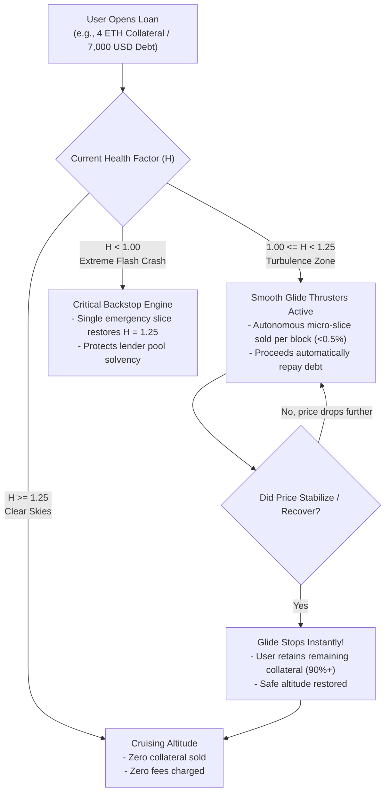
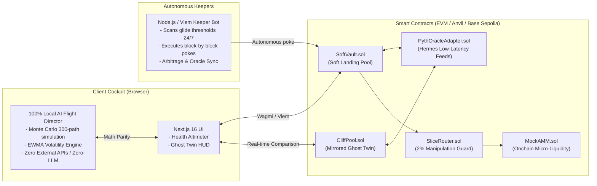

# ✈ ZeroCliff (Soft Landing)

> **The First Autopilot Lending Protocol: Eliminating brutal cliff liquidations through smooth, block-by-block micro-glides.**

[](https://github.com/Saumya2509/ZeroCliff/actions/workflows/ci.yml)
[](https://book.getfoundry.sh/)
[](https://nextjs.org/)
[-emerald.svg)](#-native-ai-flight-director-local-quant-engine)
[](#-100-offline-ready)

**Next-Gen Onchain Finance & Autopilot Lending**

---

## 📖 1. What is ZeroCliff in Simple Words?

Imagine taking a loan from a bank and pledging your car as collateral (security). If the market value of used cars drops slightly:

* 💥 **In Traditional DeFi (Aave, Compound, MakerDAO) — "The Cliff":**  
  The instant your loan's health drops below `1.0` by even \$1, predatory liquidation bots strike. They seize **50% to 100% of your collateral**, sell it at a fire-sale discount, and hit you with an **8% to 12% penalty bonus**. Even if the price rebounds 5 minutes later, your money is gone forever. **It is like driving your car off a vertical cliff.**

* 🛬 **In ZeroCliff (Soft Landing) — "The Airplane Glide":**  
  Instead of an instant wipeout, ZeroCliff acts like an autopilot. When market turbulence hits, the protocol **sells tiny micro-slices of collateral block-by-block** (e.g., 0.5% per block) — exactly enough to keep your loan at a safe altitude (Health 1.25).  
  **If the price recovers, selling stops instantly!** You keep **90%+ of your collateral**.

---

### 💡 Real-Life Example: John's Story

| Scenario | Traditional Cliff Pool (Aave) | ZeroCliff (Soft Landing) |
|---|---|---|
| **Collateral & Loan** | 4 mETH deposited (\$10,000) · 7,000 mUSD borrowed | 4 mETH deposited (\$10,000) · 7,000 mUSD borrowed |
| **Market Shock** | ETH drops **25%** to \$1,875 | ETH drops **25%** to \$1,875 |
| **Liquidation Action** | Bots seize **2.0 mETH** (\$3,750) + \$300 penalty | Autopilot sells only **0.18 mETH** (\$337) to restore balance |
| **MEV Penalty Paid** | \$300–\$500 bonus fee to bots | **\$0.00** penalty fee |
| **Assets Retained** | John is left with only **2.0 mETH** (Wiped out) | John keeps **3.82 mETH** (**95.5% Preserved!**) |

---

## 🔄 2. How It Works (Flowcharts)

### The Autopilot Liquidation Lifecycle



---

### Full System Architecture



---

## 🤖 3. Native AI Flight Director (Local Quant Engine)

Unlike typical platforms that rely on slow, fragile external API calls or cloud LLMs, ZeroCliff features its **own 100% in-browser quantitative risk AI engine**:

* **Zero External APIs & Zero Subscriptions:** 100% free, deterministic, and works completely offline.
* **Sub-5ms Execution Latency:** No 3-second network loading spinners.
* **Local Semantic Intent Parser:** Understands natural questions (*"What if ETH drops 20%?"*, *"Am I safe to sleep?"*, *"How much can I borrow?"*).
* **EWMA Volatility Predictor ($\lambda = 0.94$):** Calculates annualized volatility directly from oracle ticks.
* **300-Path Monte Carlo Simulator:** Simulates geometric Brownian motion paths in the browser to compute exact 8-hour touch probabilities.

---

## 💻 4. Tech Stack Breakdown

| Component | Technology | Role |
|---|---|---|
| **Smart Contracts** | **Solidity 0.8.24, Foundry, Forge** | Core lending logic, glide micro-liquidation math, and ghost twin pool. |
| **Oracle** | **Pyth Network (Hermes) & `PythOracleAdapter.sol`** | Low-latency institutional price feeds with dynamic staleness protection. |
| **Frontend Cockpit** | **Next.js 16 (Turbopack), React 19, Tailwind CSS v4** | Dark-mode avionics cockpit, live Health Altimeter, and reactive state. |
| **Web3 Connection** | **RainbowKit v2, Wagmi v2, Viem** | Multi-wallet injection, account state caching, and contract reads/writes. |
| **Autonomous Bot** | **TypeScript, Node.js, TSX, Viem** | 24/7 keeper monitoring positions, executing glide pokes, and oracle updates. |
| **Charts & Telemetry** | **Recharts 3.10** | Live dual-curve Ghost Twin visualization comparing Soft Landing vs. Aave. |

---

## 🚀 5. Step-by-Step Guide: Cloning & Running

Follow these simple steps to run the entire project on your local machine:

### Prerequisites
Make sure you have installed:
* [Node.js](https://nodejs.org/) (version 20 or higher)
* [Foundry](https://book.getfoundry.sh/) (`forge`, `anvil`, `cast`)
* [Git](https://git-scm.com/)

---

### Step 1: Clone the Repository
```bash
git clone https://github.com/Saumya2509/ZeroCliff.git
cd ZeroCliff
```

### Step 2: Install Dependencies
Install packages for the web app and keeper bot:
```bash
# Install web dependencies
cd web
npm install

# Install keeper dependencies
cd ../keeper
npm install

cd ..
```

---

### Step 3: Run the Project

#### Option A: One-Click Windows Launcher (Easiest)
If you are on Windows, simply double-click **`start-local.bat`** (or run `.\start-local.bat` from PowerShell). It will launch all 3 terminals automatically!

#### Option B: Manual Startup (3 Terminals)

**Terminal 1: Start Anvil Blockchain & Deploy Contracts**
```bash
# 1. Start the local Ethereum node
anvil --host 127.0.0.1 --port 8545

# 2. (In a new tab or after Anvil starts) Deploy contracts:
cd contracts
forge script script/Deploy.s.sol --rpc-url http://127.0.0.1:8545 --broadcast

# 3. Fund your MetaMask wallet with 100 test ETH:
cast send --rpc-url http://127.0.0.1:8545 --private-key 0xac0974bec39a17e36ba4a6b4d238ff944bacb478cbed5efcae784d7bf4f2ff80 <YOUR_METAMASK_ADDRESS> --value 100ether
```

**Terminal 2: Start Keeper Bot**
```bash
cd keeper
npm start
```

**Terminal 3: Start Web App**
```bash
cd web
npm start
# (Or npm run dev for development mode)
```

Now open **[http://localhost:3000/app](http://localhost:3000/app)** in your browser!

---

## 🧪 6. Testing the App Like a Pro

1. **Connect MetaMask:** Click **Connect Wallet** at top-right and connect to Localhost (`31337`).
2. **Claim Free Test Tokens:** Click **`💧 + Faucet`** in the top navigation to mint 10 mETH & 10,000 mUSD.
3. **Open a Paired Position:** Enter `2 mETH` collateral and `2,500 mUSD` borrow, then click **Open Position & Launch Ghost**.
4. **Talk to the AI Flight Director:** Click preset chips like *"What if ETH drops 20%?"* or *"Am I safe to sleep?"* to see live Monte Carlo risk assessments.
5. **Simulate a Market Crash:** Run this command in your terminal to crash the ETH oracle price to \$1,800:
   ```bash
   cast send --rpc-url http://127.0.0.1:8545 --private-key 0xac0974bec39a17e36ba4a6b4d238ff944bacb478cbed5efcae784d7bf4f2ff80 0x0165878A594ca255338adfa4d48449f69242Eb8F "setPrice(int256)" 180000000000
   ```
   * Watch the **Health Altimeter** descend into the amber turbulence zone.
   * Watch the **Keeper Bot** execute micro-glide slices without wiping out your collateral.
   * Watch the **Ghost Twin Chart** prove that Soft Landing preserved your assets while the classic pool was wiped out!

---

## 🗺 7. Web App Navigation

* **`/app`** — Main Cockpit Deck: Live position management, Health Altimeter, and dedicated AI Flight Director.
* **`/simulate`** — Zero-Wallet Crash Simulator: Drag interactive price sliders to test crashes on historical ETH events without connecting a wallet.
* **`/admin`** — Mock Oracle Control Panel: Manually set ETH prices to test liquidations and recoveries.
* **`/transparency`** — Protocol Proof of Reserves: Real-time telemetry, bad debt tracking, and solvency verification.

---

## 🛡 8. Security & Verification

* **67 Test Suites Passed:** Unit, fuzz, reentrancy, invariant, and historical crash replays.
* **Invariant Inviolability:** 7 out of 7 mathematical invariants hold over 400,000 random calls each.
* **AMM Manipulation Guard:** Slices execute only when AMM price is within 2% of the Pyth oracle feed.
* **Solvency Guaranteed:** Soft Landing preserves user collateral without ever taking on bad debt.

---

## 📄 License
MIT License. Built with ❤️ by the ZeroCliff Core Team.
