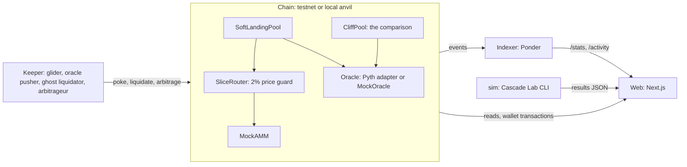

# Soft Landing

[](https://github.com/Saumya2509/ZeroCliff/actions/workflows/ci.yml)

**A lending pool that sells at most 0.5% of a risky loan's collateral per block, instead of liquidating half of it at once with a bonus.**

> Soft Landing shrinks a risky loan a little every block instead of seizing it all at once, which is only possible because onchain settlement is instant, atomic and runs 24/7.

Hack in Hills '26 · Track 3: Onchain Finance & Trading · testnet only

<!-- 60-second GIF of the ghost chart during a crash: record it from the offline demo and add it here. -->

## Links

| | |
|---|---|
| Live site | *added after the testnet deployment* |
| Demo video | *to be recorded* |
| Deck | *to be added* |
| Contracts | *explorer links added after `deploy-testnet`; addresses land in `contracts/deployments/<chainId>.json`* |

## Results

Every figure below is produced by a script and links to its source. Nothing is typed in by hand.

**Real crashes** ([web/public/results/e2.json](web/public/results/e2.json), made by `sim/cli.ts`). ETH/USDT 1-minute candles from the Binance public data archive, 200 simulated borrowers, the same loans in both pools, β = 0.3. Value kept = collateral at market minus debt, as a share of starting equity:

| Crash | Soft Landing | Cliff pool |
|---|---|---|
| 12–13 March 2020 | 22.5% | 3.5% |
| 19 May 2021 | 36.4%, nobody wiped out | 12.4%, 50 wiped out |
| 10–19 June 2022 | 23.3% | 7.1% |
| 4–5 August 2024 | 61.3% | 58.6% |

Where it looks worse, we say so. In a choppy market, and in the mildest crash, Soft Landing sells *more* ETH than the cliff pool; borrowers still keep more value because no bonus is paid. Deeper liquidity barely narrows the gap. All seven experiments, including those, are on the site's `/simulate` page.

**Contracts** ([contracts/results](contracts/results), [web/lib/results.json](web/lib/results.json)):
- 67 tests pass: unit, fuzz, attack scenarios and crash replay.
- 7 of 7 invariants hold over 400,000 random calls each, including solvency, "never glides above 1.25" and "a glide loses less than the cliff when no backstop fired".
- Selling 20 mETH in 40 slices costs 0.34% against the oracle price, vs 2.24% as one dump into the same pool.
- Pool-manipulation attack A1 costs the victim 0 mUSD with the price guard, vs 201 mUSD without it.
- The TypeScript simulator matches the contracts on 150 of 150 test vectors exported from them.

**The full stack, end to end** ([offline/README.md](offline/README.md)). On the frozen demo chain (40 paired positions), a stepped crash to −35% produced 28 glide slices and 0 backstops against 8 cliff liquidations. Losses Avoided was +3.46 mETH (18 borrowers better, 0 worse, 22 unaffected). The indexer's pool totals matched `totalDebt` and `totalCollateral` on-chain to the wei, and the keeper sent no transaction that reverted.

## Architecture



The same TypeScript engine (`web/lib/sim`) runs the site's crash simulator and the experiment CLI, and is checked against vectors exported from the contracts.

## Quick start

Requirements: Node 20+ and [Foundry](https://book.getfoundry.sh/). Every task runs as `node scripts/ops.mjs <task>`; with `make` installed, `make <task>` does the same.

```bash
git clone --recurse-submodules https://github.com/Saumya2509/ZeroCliff.git && cd ZeroCliff
node scripts/ops.mjs install        # npm ci in every package + Foundry libraries
node scripts/ops.mjs demo-offline   # local chain + indexer + keeper + site, no internet needed
                                    # site on http://localhost:3000; stop with demo-stop
```

| Task | Does |
|---|---|
| `test` | Contracts, web (including parity vectors), keeper and indexer tests |
| `abis` | Export ABIs and addresses to web, indexer and keeper |
| `offline-state` / `offline-build` | Rebuild the frozen demo chain / the offline site |
| `demo-offline` / `demo-stop` / `demo-status` | The offline finale stack |
| `deploy-testnet` | Deploy and verify on the chain in `.env` (see [.env.example](.env.example)) |
| `sim` / `charts` / `results-to-docs` | Crash experiments E1–E7, their PNGs, copies into `docs/results` |
| `hooks` | Install the pre-commit secret scan |

For the live deployment, copy `.env.example` to `.env`, fill in burner keys and the Pyth address and feed ID from Pyth's docs, and run `node scripts/ops.mjs deploy-testnet`. Then host the site on Vercel and the indexer and keeper on Railway, Render or a small VPS; each folder's README has the settings.

## How it works

| Health (collateral × price × 0.85 ÷ debt) | What happens |
|---|---|
| above 1.25 | Nothing is sold. |
| 1.02 – 1.25 | **Glide:** each block, a small slice of collateral (up to 0.5%, growing as health falls) is sold through an AMM and repays debt, never more than needed to get back to 1.25. |
| below 1.02 | **Backstop:** after a sudden gap, sell what restores 1.25 in one step. Anything unrecoverable is recorded as bad debt. |

**Flight Director.** On the dashboard you can ask about your loan in plain words: "What if ETH drops 25%?", "Am I safe to sleep?", "How much should I add to survive 30%?". It runs entirely in the browser, with no network calls and no language model. A rule-based parser reads the question. The contract's own maths, an EWMA volatility estimate, a barrier probability and a 300-path Monte Carlo produce the answer, and every number is computed with its assumptions stated ([web/lib/ai](web/lib/ai)).

A slice is only sold if the AMM agrees with the oracle to within 2%, so a manipulated pool can't be used against the borrower. Anyone can call `poke()` to run the next slice, and every user action glides too; the keeper is a convenience, not a trust assumption. Full maths: [docs/mechanism.md](docs/mechanism.md).

## Security

- **Tests:** 67 unit, fuzz, attack and crash-replay tests; 7 invariants over 400,000 random calls each ([docs/security.md](docs/security.md)).
- **Attacks we ran on ourselves:** pool manipulation, stale oracle, withdraw-to-escape, tip spam, reentrancy and more ([contracts/test/scenarios](contracts/test/scenarios)).
- **Static analysis:** Slither, 102 detectors, 35 findings, each triaged in [docs/security.md](docs/security.md).
- **Threat model:** [docs/threat-model.md](docs/threat-model.md).
- **Process:** CI on every pull request, and a pre-commit hook that blocks private keys.

## Limits and roadmap

- Testnet and local only. Test tokens have no value. Not financial advice.
- The owner can change the oracle and the sale router (public events); a timelock is on the roadmap.
- Two large price gaps in back-to-back blocks can make the backstop cost about as much as a normal liquidation.
- No interest and no lender withdrawals in this version.
- Slices wait whenever the AMM is more than 2% away from the oracle. That is the manipulation guard working, but after a sudden jump the glide depends on arbitrage catching up.
- Full list: the site's How it works page and [docs/threat-model.md](docs/threat-model.md).

## Repository

| Path | What it is |
|---|---|
| [contracts/](contracts) | Solidity 0.8.24 + Foundry: `SoftLandingPool`, `CliffPool`, `SliceRouter`, `PythOracleAdapter`, mocks, deploy script, tests |
| [web/](web) | Next.js 16 app: landing page, the dApp, Cascade Lab crash simulator, transparency page |
| [sim/](sim) | Cascade Lab CLI: historical crashes and experiments E1–E7 |
| [indexer/](indexer) | Ponder indexer and the Losses Avoided number |
| [keeper/](keeper) | Keeper bot and the test-activity seed script |
| [offline/](offline) | The frozen demo chain and the finale checklist |
| [docs/](docs) | Mechanism, threat model, security review, gas report |
| [scripts/](scripts) | `ops.mjs` task runner, ABI export, results collection, git hooks |

## Team

*Names and roles to be added.*
